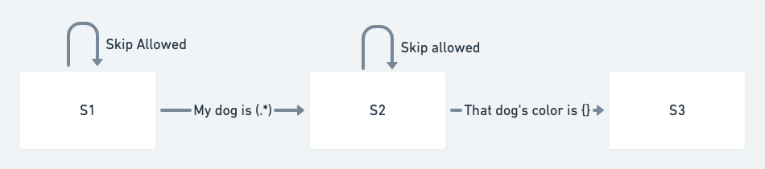
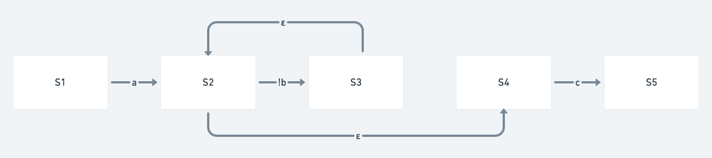

# LogRegex

LogRegex allows you to find patterns inside of logs. Let's jump right into an example:

```typescript
import { FileHandler, LogRegex, Matcher } from "./index";

function main() {
  const contents = `
  2021-11-22T19:18:47.000Z My dog is brown
  2021-11-22T19:18:48.000Z Can I find my dog?
  2021-11-22T19:18:49.000Z That dog's color is white
  2021-11-22T19:18:50.000Z That dog's color is brown
  `;

  // Step 1) Construct a LogRegex
  const lre = new LogRegex();
  lre.matchAllRepeat();
  // The (.*) is capturing a variable here inside of the regex. In this example "brown" will be captured.
  const match = lre.match("My dog is (.*)");
  // Allow this search to skip over some lines until...
  lre.matchAllRepeat();
  // Until we find this match. Note there are two interesting things:
  // A) We care about timestamps. This match needs to come 20s after the "My dog is" search.
  // B) We use the captured variable above here as a variable. match.at(0) means the first captured part of the regex.
  lre.match("That dog's color is {}", match.timeComparison("<20s"), [
    match.at(0),
  ]);

  // Step 2) Run the LogRegex over a given input
  const file = new FileHandler(contents.split("\n"));
  const matcher = new Matcher();
  if (matcher.match(file, lre)) {
    console.log("The pattern correctly showed up in the logs!");
  }
}

main();
```

This example showcases how LogRegex is more powerful for log searching over a regular Regex (or using log analysis tools like Splunk):

- It's easier to understand. All the regexes are per-line, so for a log-based use case, this makes sense. If you were instead looking for patterns in a book, per-line searches might be more limiting than helpful.
- Timestamps are part of the search query. You can find two log lines that are within a certain time range of one another, for example.
- We allow some captured part of the search to be queried upon later on. For example, if you have an id for a web request in your logs, you could only match log lines that have that id.


That's it! It's a tiny proof of concept, but I haven't seen this built anywhere else. I'm not sure how common this problem is for people, but I often have a need for a tool like this.

# How to run
The few dependencies are managed by yarn. I typically run this via node. Since this is typescript, `ts-node` is a quick way to get things running.
- `yarn install`
- `npx ts-node example.ts`

# Implementation Details
The implementation was inspired by a series of blog posts on [how to build a Regex Engine](https://kean.blog/post/lets-build-regex).

There are two steps involved:
1) Build a graph
2) Search over the graph

## Building the graph

Here's what the graph looks like for the example above:



## Search over the graph
I'll now explain what the graph means by showing you how I traverse over it. Let's take the above example. I do a depth first search over the graph, starting at `S0` with a goal of getting to `S2`. During the search, I keep track of the following state:

- Where I am in the graph (i.e. S0)
- Where I am in the contents I'm searching over (i.e. line number 3)
- What has been captured (inside of the regex captures) as I step through the graph. In this example, "brown" gets stored when the line "My dog is brown" is executed over the graph edge "My dog is (.*)".
- Time stamps, when matches happen. In this example, I remember the timestamp `2021-11-22T19:18:47.000Z` when the line "My dog is brown" is executed over the graph edge "My dog is (.*)".

With this state in mind, the logic of the search is as follows: an edge is traversable if the current state allows that edge to be traversed. Let's take an example state:

- `Location`: `S1`
- `Line`: `2021-11-22T19:18:49.000Z That dog's color is white`
- `Captures`: A previous match (represented by the variable `match` as shown in the above example) has the following array of captures: `["brown"]`
- `Timestamps`: A previous match (represented by the variable `match` as shown in the above example) has the following tiemstamp: `2021-11-22T19:18:47.000Z`

We now have two edges that we can follow: `S1 -> S1` and `S1 -> S2`. The `S1 -> S1` edge was created because of the call to `lre.matchAllRepeat()`. That is, it allows an "ungreedy" match of anything. So as we are not at the end of the file, this edge can be traversed. For the other edge, this can only be traversed if (A) the timestamp is within 20s of `2021-11-22T19:18:47.000Z` (it is), and the lines matches the following regex: `That dog's color is brown`. Note that the `{}` of the search has been replaced by the string inside of the `Captures` state above.

In this example, the first edge can be traversed but the second cannot. During each edge traversal, the state gets modified. In this case, the only state that changes is the Line. The line now becomes `2021-11-22T19:18:50.000Z That dog's color is brown`. With this new state, both edges are now traverseable. Once we traverse the `S1 -> S2` edge, we'll notice that we're at the target. As such, we stop the search.

## Graphs with `unmatchRepeat`
Let's take another example:
```typescript
  const lre = new LogRegex();
  lre.match("a");
  lre.unmatchRepeat("b");
  lre.match("c");
```
This should match a file that:

- Has the first line that contains an "a"
- Has some line following this that contains a "c"
- BUT, there should be no line between these two lines that contains a "b"

Here's how we model it in a graph:



The Epsilon character (ε) represents an edge that can be traversed without incrementing the line number. As an example, we can move along the `S2 -> S4` edge with only changing the `Location` in the graph, and nothing else about the state. I'll leave it as an exercise to the reader on how the above graph represents this example. Note that `unmatchRepeat` is "ungreedy" in regex terms.

## Performance
I've done no performance analysis on this tool. It's probably very slow for certain types of queries, or on really large logs. There are copious opportunities to speed this up.

# API
The API is currently minimal, but useful. 

Let's first look at `class SingleMatch`:
```typescript
  /**
   * Gets a "reference" to a captured group.
   *
   * @param index The captured index, starting at 0.
   * @returns The purpose of this is to be put into a `LogRegex.match` call.
   */
  public at(index: number): ReGroup
```
```typescript
  /**
   * Gets a "reference" to a matched time
   *
   * @param timePattern "ex: <20s" meaning "with respect to this match, match another line that is within 20s". Only seconds are supported. Only < and > are supported.
   * @returns The purpose of this is to put into a `LogRegex.match` call.
   */
  public timeComparison(timePattern: string)
```

The other interesting class is `LogRegex`:
```typescript
  /**
   * Match zero or more lines in an ungreedy manner, unless the time requirement
   * is not met. "Ungreedy" means that this does not necessarily consume until
   * it does not find a match. It merely *can* consume until it does not find a
   * match.
   *
   * @param timeComparison An optional parameter that is the return value of SingleMatch.timeComparison()
   */
  public matchAllRepeat(timeComparison?: TimeComparison)
```
```typescript
  /**
   * Match a single line.
   *
   * @param pattern A regex pattern to match.
   * @param timeComparison An optional parameter that is the return value of SingleMatch.timeComparison()
   * @param groups An optional array. Each entry is constructed from the return value of SingleMatch.at()
   * @returns A SingleMatch
   */
  public match(
    pattern: string,
    timeComparison?: TimeComparison,
    groups?: ReGroup[]
  ): SingleMatch
```
```typescript
  /**
   * Find zero or more lines that do not match `pattern` in an ungreedy manner.
   * "Ungreedy" means that this does not necessarly consume until it finds a
   * match. It merely *can* consume until it finds a match.
   *
   * @param pattern A regex pattern to NOT match.
   * @param timeComparison An optional parameter that is the return value of
   *  SingleMatch.timeComparison(). If a line does not match this time
   *  comparison, it is not matched. That is, the logic inversion is only for the
   *  match, but not for the time.
   * @param groups An optional array. Each entry is constructed from the return value of SingleMatch.at()
   */
  public unmatchRepeat(
    pattern: string,
    timeComparison?: TimeComparison,
    groups?: ReGroup[]
  )
```
